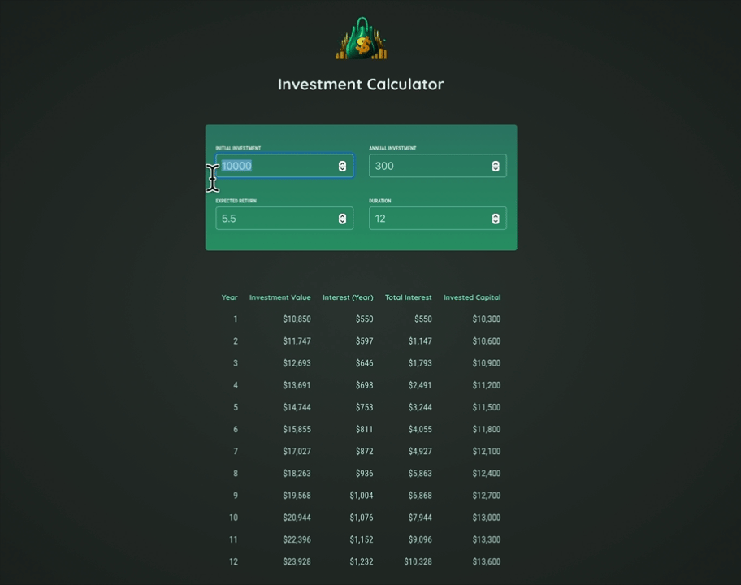

# Investment Calculator App

A simple app to visualize and track the growth of your investments over time. Enter your investment details and see a detailed year-by-year breakdown of your returns and capital growth.

## Features

- For entering investment details:
  - Initial Investment: Starting amount of money invested.
  - Annual Investment: Amount added each year to your investment.
  - Expected Return Rate: Annual percentage rate of return.
  - Duration: Investment period in years.
- Provides a detailed yearly breakdown of:
  - Investment value at the end of each year.
  - Interest earned.
  - Total accumulated interest.
  - Invested capital.
- Automatically calculates and displays results in a clear table format.
- Real-time updates based on input changes.
