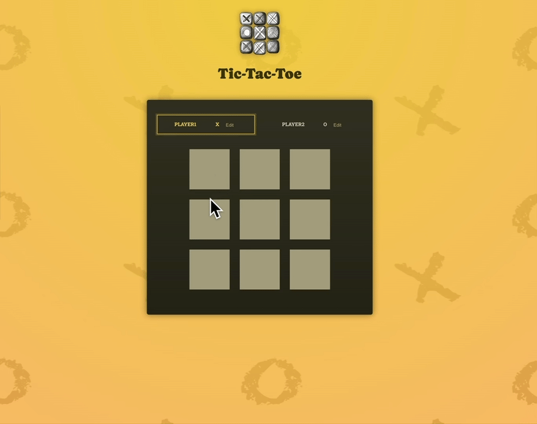

# Tic-Tac-Toe Game

A simple, interactive Tic-Tac-Toe game built with React. This game allows two players to take turns, tracks the game state, identifies the winner, and includes a user-friendly interface.

## Features

- Interactive Tic-Tac-Toe board.
- Two-player mode with alternating turns.
- Automatic winner detection based on the standard rules of Tic-Tac-Toe.
- Highlights the active player.
- Logs the history of moves.
- Prevents overwriting already filled squares.
- Friendly user interface with real-time updates.

## Demo

## Setup
1. Install dependencies
   `npm install`
2. Run the development server
  `npm run dev`
3. Open in your browser: Navigate to `http://localhost:5173/` to play the game
